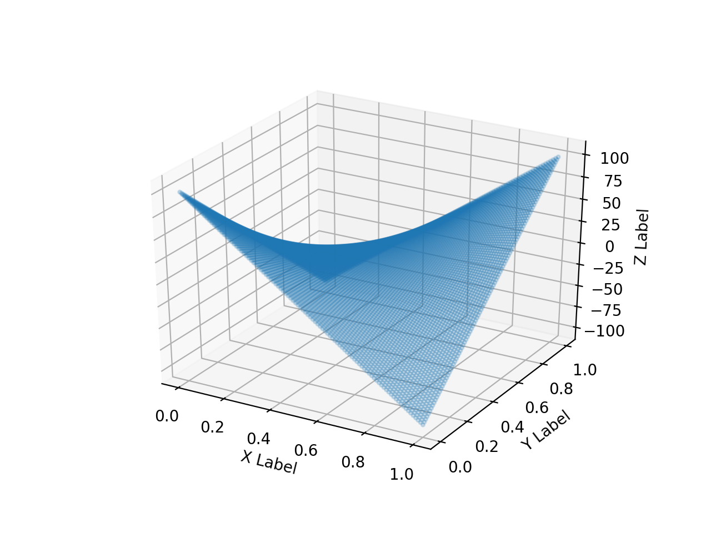

# Parallel programming: Solving PDE

Solve Poisson equation by hybrid programming with OpenMP and MPI.

## Compile

Replace the compiler path with yours and then execute the following commands.

`$ cmake -DCMAKE_DEBUG_TYPE=Release`

`$ make`

## Usage

* -np: number of processors
* --grids: size of grids
* --threads: number of threads
* --method: 0 for hybrid OpenMP-MPI, 1 for OpenMP only, default for Sequential method
* --output: output path

`$ mpirun -np 6 ./pde --grids 100 --threads 3 --method 0 --output u.data`

`$ ./pde --threads 3 --method 1`

`$ ./pde --method 2`

